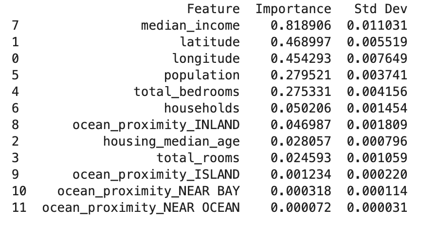
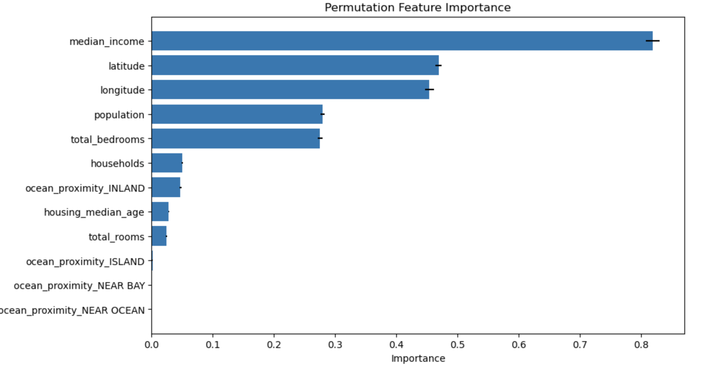

 This repo focuses on building a regression model to predict house prices in California using scikit-learn, and then interpreting the model using permutation feature importance. 

Here's a step-by-step approach:

Step 1: Import Libraries and Load Data
First, ensure you have the necessary libraries installed and load the dataset.

Step 2: Preprocess the Data
Perform necessary preprocessing steps such as handling missing values, encoding categorical variables, and splitting the data into training and test sets.

Step 3: Build and Train the Model
Build and train a linear regression model.

Step 4: Interpret the Model using Permutation Feature Importance
Use the permutation_importance function from scikit-learn to understand the importance of different features.

Output & Conclusion

